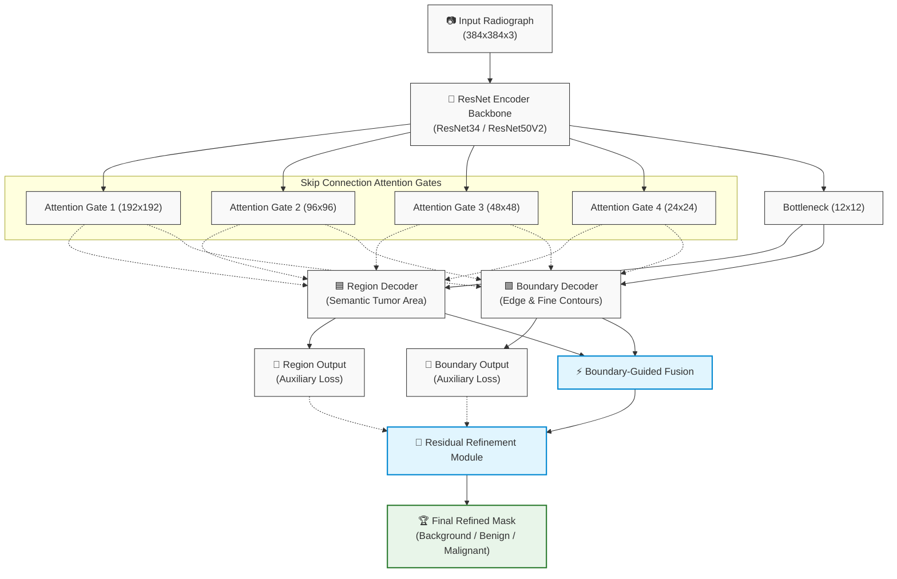

# Dual-Decoder ResNet for Bone Tumor Segmentation (BTXRD)

[](https://www.python.org/)
[](https://tensorflow.org/)
[](https://hydra.cc/)
[](LICENSE)
[](https://github.com/)

An end-to-end deep learning framework for precise bone tumor segmentation in radiographs (**BTXRD dataset**). The architecture features a **Dual-Decoder ResNet** with **Skip-Connection Attention Gates**, **Boundary-Guided Feature Fusion**, and **On-the-Fly Boundary Generation**.

---

## 🌟 Key Highlights

- **Decoupled Dual-Decoder Architecture**:
  - **Region Decoder**: Learns high-level semantic tumor areas (Background, Benign, Malignant).
  - **Boundary Decoder**: Focuses explicitly on sharp tumor margins and complex structural boundaries.
- **Attention Gates on Skip Connections**: Suppresses background noise in radiograph tissues and emphasizes salient tumor cues before concatenation.
- **Boundary-Guided Feature Fusion & Refinement**: Fuses multi-scale edge signals to refine blurred borders and eliminate false boundary predictions.
- **On-the-Fly Boundary Generation (`DualDecoderWrapper`)**: Dynamically extracts crisp boundary ground truth masks during training using morphological pooling operations (`tf.nn.max_pool2d`) — **no manual boundary annotation required**.
- **Compact Progress Tracking**: Clean, single-line in-place terminal progress bar and detailed per-class CSV metric logging (Dice, IoU, Precision, Recall).

---

## 🏛️ Architecture Overview



---

## 📁 Repository Structure

```plaintext
DualDecoder-BoneTumor-Seg/
├── callbacks/
│   ├── comprehensive_metrics_callback.py  # Per-class evaluation (Dice, IoU, Precision, Recall)
│   ├── progress_callback.py               # Clean single-line progress logger
│   └── timing_callback.py                 # Latency & throughput timing
├── configs/
│   └── config.yaml                        # Hydra configuration (hyperparameters, paths)
├── data_generators/
│   ├── data_generator.py                  # DualDecoderWrapper for real-time boundary targets
│   └── tf_data_generator.py               # Data loading, batching & data augmentation
├── data_preparation/
│   └── verify_data.py                     # Image-mask pair verification
├── losses/
│   ├── dual_decoder_loss.py               # Multi-task loss (Region Dice + Boundary BCE)
│   ├── loss.py                            # DiceCoefficient, IoU, Focal loss
│   └── unet_loss.py                       # Weighted dice loss implementations
├── models/
│   ├── dual_decoder_resnet.py             # Core Dual-Decoder ResNet architecture
│   ├── backbones/                         # Encoder backbones (ResNet, VGG)
│   └── model.py                           # Model factory dispatcher
├── utils/
│   ├── boundary_utils.py                  # Morphological boundary extraction (TF & OpenCV)
│   ├── general_utils.py                   # GPU management, path resolution
│   └── images_utils.py                    # Preprocessing, normalization, mask colorization
├── train_dual_decoder.py                  # Primary training pipeline
├── evaluate.py                            # Comprehensive evaluation & metrics script
├── predict.py                             # Inference & visual prediction
├── benchmark_inference.py                 # Speed & latency benchmarking
├── requirements.txt                       # Python dependencies
└── README.md
```

---

## 🚀 Installation & Setup

### 1. Clone the repository
```bash
git clone https://github.com/masterth21/DualDecoder-BoneTumor-Seg.git
cd DualDecoder-BoneTumor-Seg
```

### 2. Create and activate Conda environment
```bash
conda create -n unet_gpu python=3.10 -y
conda activate unet_gpu
```

### 3. Install dependencies
```bash
pip install -r requirements.txt
pip install tensorflow[and-cuda]  # or tensorflow-gpu==2.10 for Windows native
```

---

## 📂 Dataset Organization

Organize the **BTXRD** dataset under your data directory following this structure:

```plaintext
BTXRD/
└── split/
    ├── train/
    │   ├── images/     # Input radiograph images (.png / .jpg)
    │   └── mask/       # Segmentation masks (0: Background, 1: Benign, 2: Malignant)
    └── val/
        ├── images/
        └── mask/
```

> **Note**: Update paths in `configs/config.yaml` or pass them via CLI overrides.

---

## 🏋️ Model Training

### Quick Start
To train the model using default parameters in `configs/config.yaml`:
```bash
python train_dual_decoder.py
```

### High-Performance Training (Recommended for 8GB-12GB GPUs)
```bash
python train_dual_decoder.py \
  HYPER_PARAMETERS.BATCH_SIZE=8 \
  HYPER_PARAMETERS.LEARNING_RATE=4e-5 \
  DATALOADER_WORKERS=8 \
  OPTIMIZATION.XLA=False
```

### Max-Throughput Training (For 16GB-24GB GPUs: RTX 3090, 4090, A5000, A100)
```bash
python train_dual_decoder.py \
  HYPER_PARAMETERS.BATCH_SIZE=16 \
  HYPER_PARAMETERS.LEARNING_RATE=8e-5 \
  DATALOADER_WORKERS=8 \
  OPTIMIZATION.XLA=False
```

### Custom Dataset Paths Override
```bash
python train_dual_decoder.py \
  DATASET.TRAIN.IMAGES_PATH="BTXRD/split/train/images" \
  DATASET.TRAIN.MASK_PATH="BTXRD/split/train/mask" \
  DATASET.VAL.IMAGES_PATH="BTXRD/split/val/images" \
  DATASET.VAL.MASK_PATH="BTXRD/split/val/mask" \
  HYPER_PARAMETERS.BATCH_SIZE=8 \
  HYPER_PARAMETERS.EPOCHS=200
```

---

## 📊 Evaluation & Inference

### 1. Evaluate on Validation Set
Calculates comprehensive metrics (Dice Overall, Dice Benign, Dice Malignant, IoU, Precision, Recall):
```bash
python evaluate.py
```

### 2. Run Inference and Visualize Predictions
Visualizes sample predictions with side-by-side ground truth comparisons:
```bash
python predict.py
```

### 3. Benchmark Inference Speed
```bash
python benchmark_inference.py
```

---

## 📈 Monitoring & Checkpoints

- **Checkpoints**: Saved automatically to `checkpoint/model_dual_decoder_resnet.hdf5` based on best `val_refined_output_dice_coef`.
- **Metrics Log**: Comprehensive per-epoch metrics logged to `checkpoint/training_detailed_logs_dual_decoder_resnet.csv`.
- **TensorBoard**:
  ```bash
  tensorboard --logdir checkpoint/tb_logs
  ```

---

## 📜 License

This project is licensed under the MIT License - see the [LICENSE](LICENSE) file for details.
